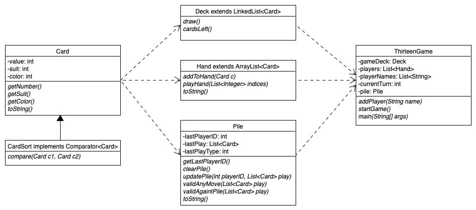

# thirteen-console

## Challenge:

Build a console-based (i.e. runs in terminal) unix-compatible interactive card game.

## Program Requirements:

1)	A working installation of Java 11 (has not been tested on other versions)
2)	A working installation of the GNU make utility
3)	A working installation of git (optional)

## Instructions for starting the game:

Clone or download the files from the following link and navigate to your downloaded directory using the cd command in your UNIX shell. This can be done with either git clone or through downloading through a browser.
```
https://github.com/18jeffreyma/thirteen-console.git
```

I have provided a Makefile for this Java project to simplify building and compiling. As long as a working installation of Java 11 is present on your system, the project should compile with no issues. Type in the following to your command line:
```
make
```

3. This will compile the downloaded .java files into .class files. To run the game, you can type in either of the following options:

```make run {name1} {name2} ... ``` or  ```java ThirteenGame {name1} {name2} ...```

The arguments that follow should be the names of each of the players who will be playing as well as the order that you will be playing in. A starting player will be chosen with the game rules, but the order will remain the same for the entire game.

From here on, the program will provide instructions on how to play, so enjoy and have fun! This is a offline multiplayer game, where all players will play on a single device.

## Game UML Diagram



## About Thirteen (Game Rules):

Thirteen is a card game invented in Vietnam and Southern China, in which the objective of the game is to get rid of all of your cards. In a standard four-person game (though the game can be played with more or less), each player is dealt 13 cards, hence the origin of the name.

The game can be explained in several parts, which are listed below:

### The Ranks of the Cards:

For easy memory, in several other regions, a variation of Thirteen known as “Big Two” is played, which describes the ranking of the cards from lowest to highest, which are:

    3, 4, 5, 6, 7, 8, 9, 10, Jack, Queen, King, Ace, 2

Additionally, suits also have a rank in this game, and from lowest to highest, they are:

    Spades ♠, Clubs ♣, Diamonds ♦, and Hearts ♥

Note that the 3 of spades is the lowest single card in the game, while the 2 of hearts is the highest ranked. Thus, the rules of the game state that the player who has the 3 of Spades has the starting round of the game (this program will automatically start with that player). If we play with less than four players, and the 3 of Spades is not dealt, the game will default to the player with the lowest ranked card.

### The Five Types of Plays:

In Thirteen, there are five types of plays:

1.	Singles, where you play a single card (i.e. 8♠).
2.	Pair/Doubles, where you play two cards of the same value (i.e. 9♣, 9♦)
3.	Triples, where you play three cards card of the same value (i.e. 3♠, 3♣, 3♥)
4.	Straights, where you play three or more cards that are in a sequence (6♠, 7♣, 8♥, 9♣)
5.	Bombs, where you play four cards of the same value (i.e. A♠, A♣, A♥, A♦)

For the first four listed above, note that if the player before you plays a single, you must also follow with a single (the same for doubles, triples, etc). If you wish to play a straight, you must have the same length and have a larger straight than the player before you. The special case is for bombs, which can be played when any other play is on the pile. In the event a bomb is played on a single, pair, triple, or straight, in order to “beat” the bomb and win the pile, you must have a bomb of a higher number. An implementation note, for this program, suits only contribute to the size of a card when singles are in play (i.e. 3 ♠ is larger than a 3 ♣)

We’ll talk about later what it means to win the pile.

### General Gameplay Flow

The general game flow is as follows:

1.	Deck is shuffled and cards are dealt (either 13 cards per person for <4 players or an even number of cards per person for 5+). The player who was dealt the 3 of Spades or the lowest card in play will go first.

2.	Turns will proceed in a sequential fashion based on a predetermined order.

3.	When it is your turn, you can decide if you wish to Play or Pass.

  a.	If you wish to Pass, you are unable to play again until all other players in the round have passed (i.e. no jumping in). Note that you must pass if you are unable to make a valid play.

  b.	In order to make a Play, you must play a hand that is “higher” than the hand currently on the top of the pile. Also, the hand you play must be of the same type as currently on the pile (e.g. if the first player played pairs, everyone must play pairs until the round is over). The notable exception to this is playing a bomb, which changes the type of the pile to bombs only.

4.	A player wins the pile when all other places pass, either by choice or by inability to make a move. When this happens, the pile is cleared, and this player can start the pile with whatever play they wish.

5.	The winner is the first player to get rid of all of their cards, at which point the game will end.
